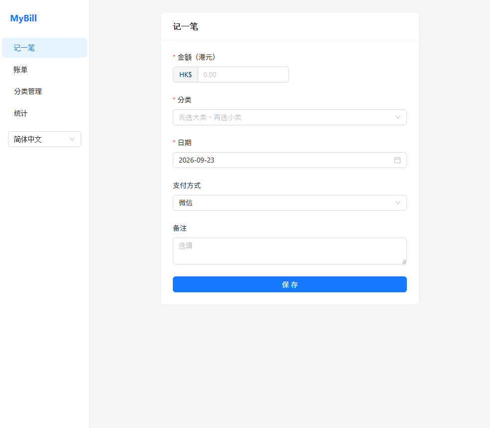
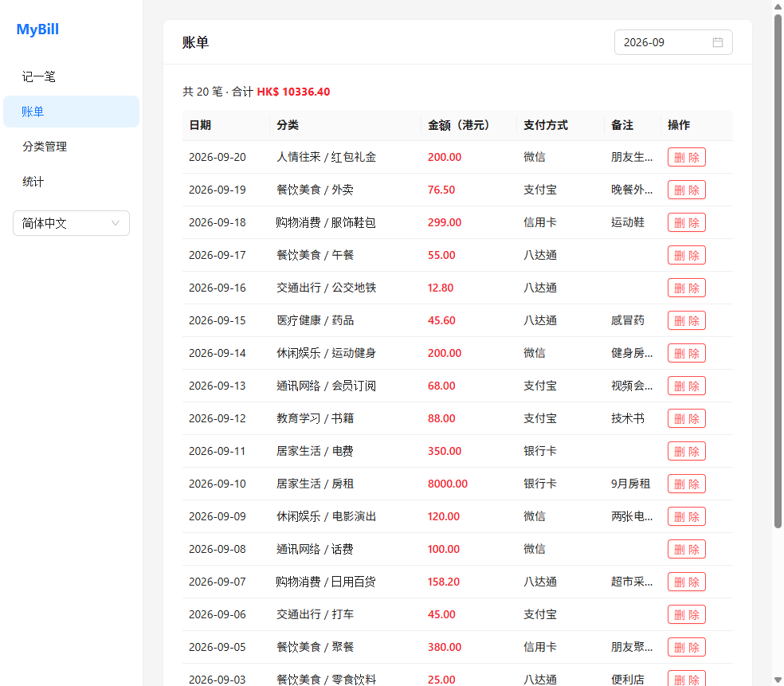
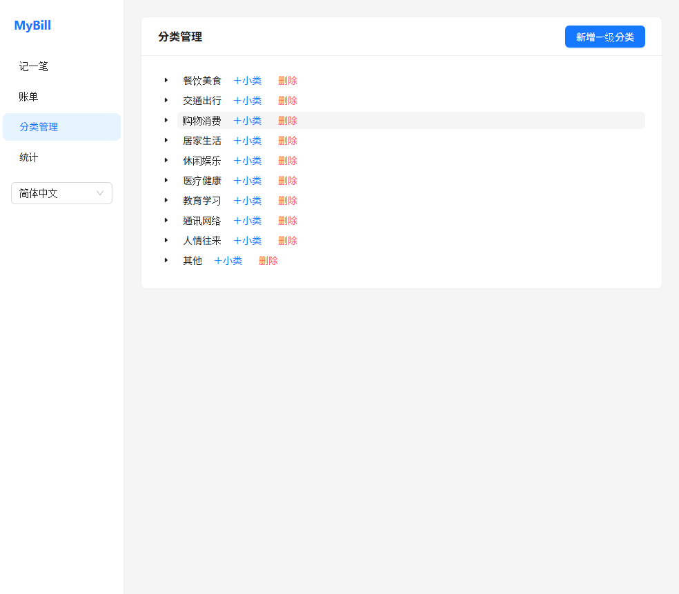
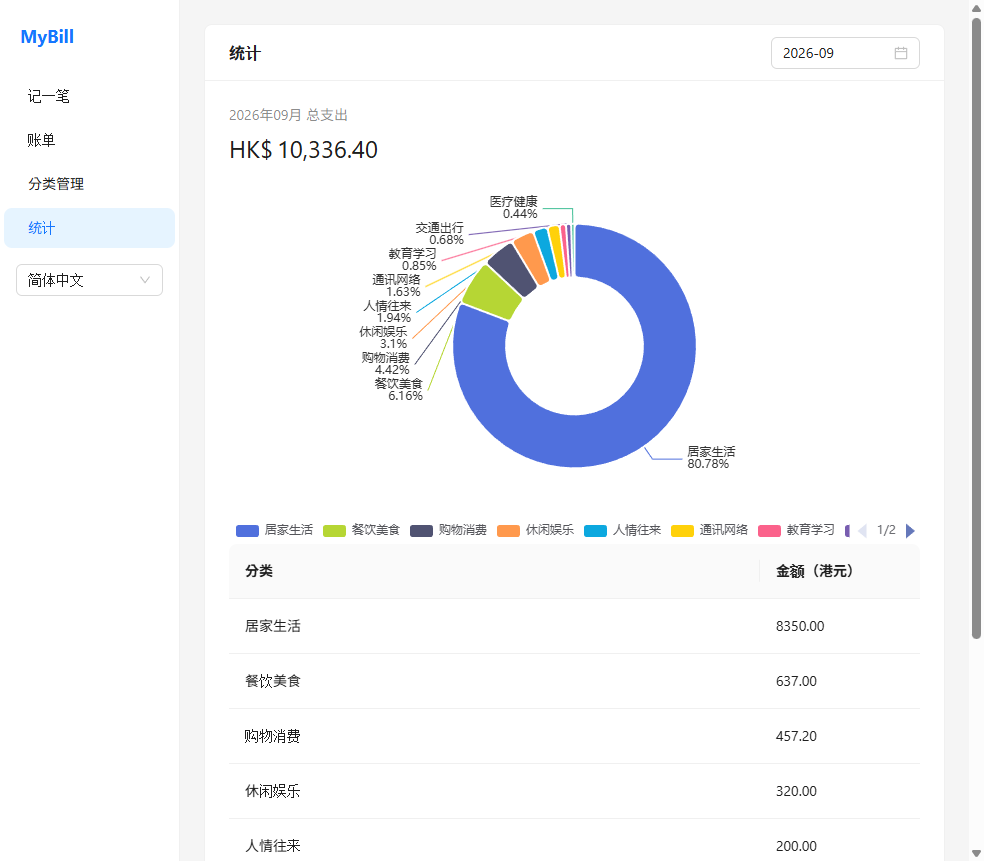

# MyBill

A simple, clean desktop app for tracking your daily expenses — completely offline, no account needed.

> 💱 All amounts are recorded in Hong Kong dollars (HK$).

## ✨ Features

- **Quick expense entry** — record an amount, category, date, payment method, and note in seconds.
- **Two-level categories** — every expense belongs to a *primary category* → *subcategory* (both fully customizable).
- **Bills list** — browse past records and filter by month.
- **Category management** — add or remove primary and secondary categories.
- **Statistics with a pie chart** — see monthly totals and the spending breakdown by category.
- **Trilingual interface** — Simplified Chinese, Traditional Chinese, and English (category names are localized too).
- **Payment methods** — WeChat, Alipay, cash, bank card, credit card, Octopus, and more.
- **Cross-platform** — runs on Windows and macOS.
- **100% local & offline** — your data never leaves your computer.

## 📸 Screenshots

**Record**



**Bills**



**Categories**



**Statistics**



## 🛠 Tech Stack

| Layer | Choice |
|---|---|
| Desktop framework | Electron |
| UI | React 19 + Ant Design 6 |
| Data storage | SQLite via sql.js (compiled to WebAssembly) |
| Charts | ECharts |
| Internationalization | react-i18next |
| Build tooling | electron-vite + electron-builder |

## 📂 Built-in Categories

| Primary | Subcategories |
|---|---|
| Food & Dining | Breakfast, Lunch, Dinner, Takeout, Snacks & Drinks, Dining Out |
| Transportation | Bus & Metro, Taxi, Fuel, Parking, Train, Flight |
| Shopping | Clothing & Shoes, Electronics, Daily Goods, Beauty & Skincare, Home Goods |
| Household | Rent, Water, Electricity, Gas, Property Fee, Repairs & Renovation |
| Entertainment | Movies & Shows, Games, Sports & Fitness, Travel, Pets |
| Health & Medical | Medicine, Clinic, Hospital, Checkup, Dental & Eye Care |
| Education | Books, Courses & Training, Tuition, Stationery |
| Communication | Phone Bill, Broadband, Subscriptions |
| Social | Red Packets & Gifts, Treating & Gifts, Supporting Parents |
| Other | Other |

All categories are editable — you can add, rename, or delete them at any time.

## 🚀 Getting Started

### Prerequisites

- [Node.js](https://nodejs.org/) 18 or later
- npm (bundled with Node.js)

### Install dependencies

```bash
npm install
```

### Run in development

```bash
npm run dev
```

### Build an installer

```bash
# Windows
npm run build:win

# macOS
npm run build:mac

# Linux
npm run build:linux
```

The packaged output is written to the `dist/` folder.

## 📁 Project Structure

```
.
├── src
│   ├── main        # Electron main process (window, database, IPC)
│   ├── preload     # Secure bridge between main and renderer
│   └── renderer    # React UI (pages, components, i18n)
├── build           # App icons and packaging resources
├── resources       # Runtime resources
├── electron-builder.yml
└── electron.vite.config.mjs
```

## 💾 Data Storage

All your expenses are stored in a local SQLite database (`heima-bill.db`) inside the app's user-data directory. There is no cloud sync and no account — your data stays on your own machine.
